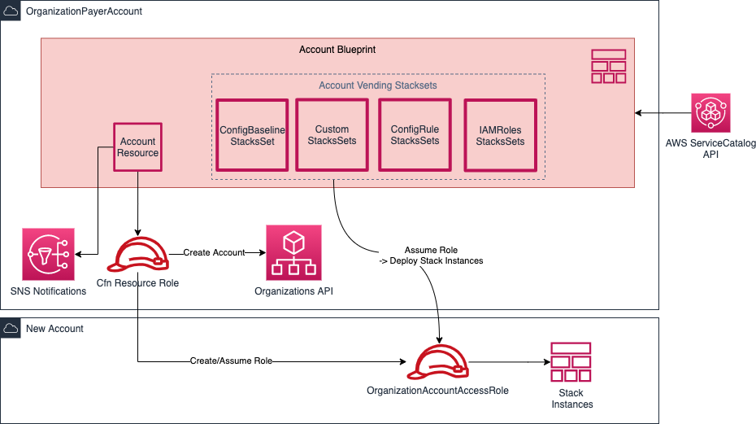

**repository _moved_, maintained elsewhere -> https://github.com/curlim/aws-organizations-account-resource**


# Concurrent Cross-Account Account Vending Cloudformation Resource Provider

This AWS CloudFormation resource provider implements the concurrent creation of new Accounts using the AWS Organizations API.

## Typical Use Case

The process of vending accounts is one of most important task while setting up a cloud foundation on AWS.
This resource provider helps to vend accounts reliable and concurrent. 

## ProServe::Organizations::Account

See example usage of the resource below. Detailed documentation can be found in the [/docs](docs) folder.

## Usage

Simple Example:

```yaml
Account:
  Type: ProServe::Organizations::Account
  Properties:
    AccountName: f3ddb23235a8d1ff-test
    AccountEmail: f3ddb23235a8d1ff-test@my-corp.com
    OrganizationalUnitId: ou-abcd-12345678

Outputs:
  AccountId:
    Value: !Ref Account
```

Example with dedicated deployment account access role and cost center tag. Additionally, it will actually **close** the AWS Account automatically on deletion in AWS CloudFormation:
```yaml
Account:
  Type: ProServe::Organizations::Account
  Properties:
    AccountName: f3ddb23235a8d1ff-test
    AccountEmail: f3ddb23235a8d1ff-test@my-corp.com
    OrganizationalUnitId: ou-abcd-12345678
    AlternateContacts:
      Billing:
        Email: f3ddb23235a8d1ff-billing@my-corp.com
        Name: John Doe
        PhoneNumber: 123-456-7890
        Title: Billing Dep
      Operations:
        Email: f3ddb23235a8d1ff-ops@my-corp.com
        Name: John Doe
        PhoneNumber: 123-456-7890
        Title: Ops Center
      Security:
        Email: f3ddb23235a8d1ff-sec@my-corp.com
        Name: John Doe
        PhoneNumber: 123-456-7890
        Title: Security Officer
    DeploymentAccountConfiguration:
      AccountId: 123456789012
      RoleName: DeploymentAccountAccessRole
      AWSManagedPolicyArns:
      - arn:aws:iam::aws:policy/AdministratorAccess
    CloseAccountOnDeletion: true
    Tags:
    - Key: mycorp:CostCenter
      Value: ABC123

Outputs:
  AccountId:
    Value: !Ref Account
  AccountReqId:
    Value: !GetAtt Account.AccountRequestId
```

Before you can update the alternate contact information for an AWS account that is managed by AWS Organizations, you must first enable integration between AWS Account Management and Organizations. For more information, see [Enabling trusted access for AWS Account Management](https://docs.aws.amazon.com/accounts/latest/reference/using-orgs-trusted-access.html).


## Quickstart

You can use the following link to deploy the CloudFormation resource provider directly into your AWS account. Ensure you are logged into the AWS Console before following it.
After following the link, ensure you picked the desired **Region** on the top right within the AWS Console.

[Quickstart CloudFormation Link](https://console.aws.amazon.com/cloudformation/home?region=eu-west-1#/stacks/new?templateURL=https:%2F%2Fs3.amazonaws.com%2Faws-enterprise-jumpstart%2Faws-organizations-account-resource%2Fcfn-provider-registration.yaml)

## Cross-Account Configuration

To enable cross-account functionality you have to set a type configuration on the private cloudformation resource provider
```bash
aws cloudformation set-type-configuration --type-arn <type-arn-without-version> --configuration-alias standard --configuration "{\"RoleArn\":\"<aws-iam-role-arn>\"}"
```
To disable cross-account functionality, put an empty type configuration:
```bash
aws cloudformation set-type-configuration --type-arn <type-arn-without-version> --configuration-alias standard --configuration "{}"
```

## Architecture

Account Vending Stacksets are **NOT** part of this resource provider.



## Hints

* While code samples in this repository has been tested and believe it works well, as always, be sure to test it in your environment before using it in production!

The RPDK will automatically generate the correct resource model from the schema whenever the project is built via Maven. You can also do this manually with the following command: `cfn generate`.

> Please don't modify files under `target/generated-sources/rpdk`, as they will be automatically overwritten.

The code uses [Lombok](https://projectlombok.org/), and [you may have to install IDE integrations](https://projectlombok.org/setup/overview) to enable auto-complete for Lombok-annotated classes.

## Security

See [CONTRIBUTING](CONTRIBUTING.md#security-issue-notifications) for more information.

## License

This library is licensed under the MIT-0 License. See the LICENSE file.
